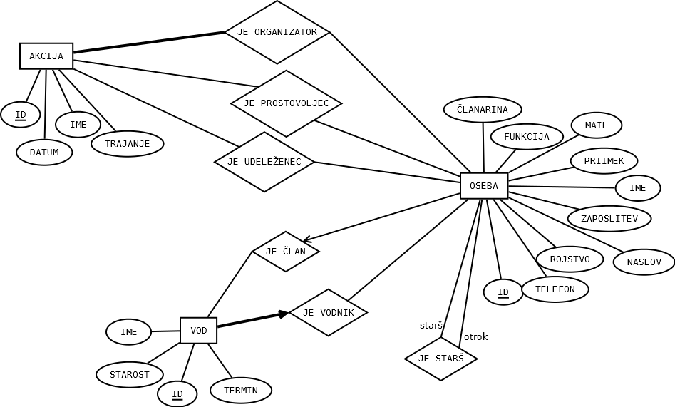

# Baza-clanstva-RDR

Kot admin se lahko prijavite z: uporabniško ime: admin, geslo: admin1234

Kot starš se lahko prijavite kot že obstoječi starš z: uporabniško ime: test2, geslo: testgeslo
  
Lahko pa si ustvarite nov profil starša po spodnjem postopku:
1. Prijavite se kot admin z zgoraj navedenim uporabniškim imenom in geslom. V razdelku 'DODAJ/ODSTRANI ČLANA' vnesite svoje podatke brez šumnikov (za kasnejšo registracijo je pomembnih le prvih 6 polj). Pri prvem polju, kjer je na voljo več možnosti pa je pomebno, da izberete 'starš', ker le starši se lahko kasneje registrirajo.
2. Odjavite se kot admin in se registrirajte s podatki, ki ste jih vnesli v prvi točki.

ER diagram:

